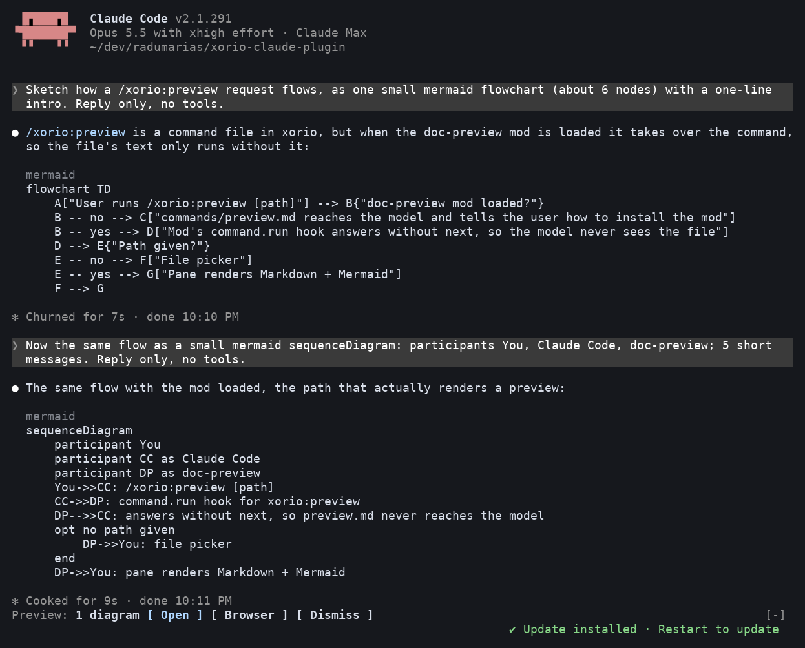
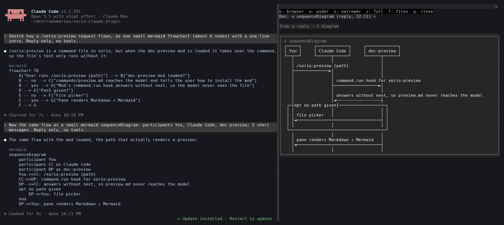
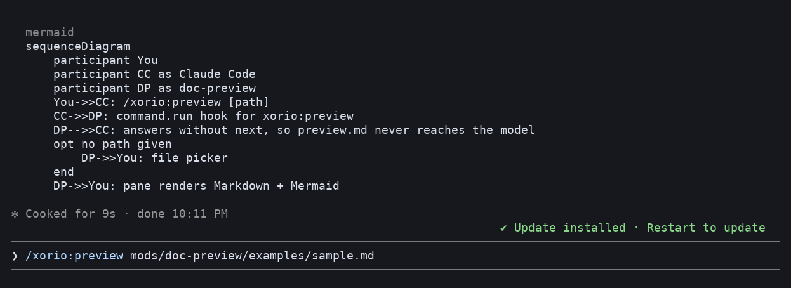
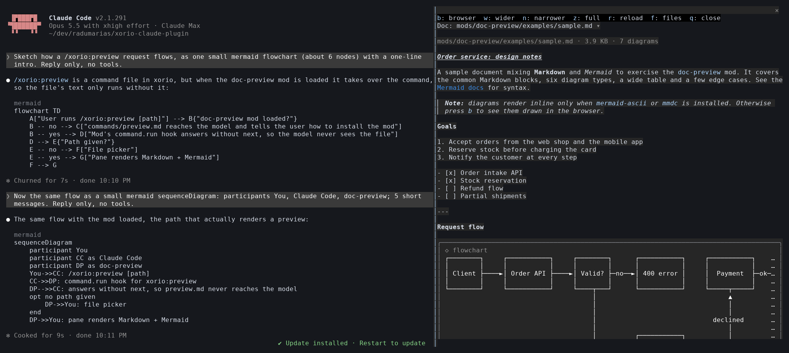
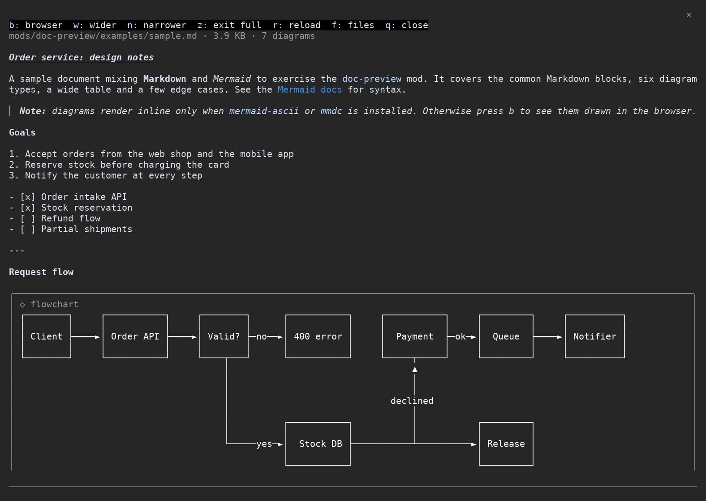
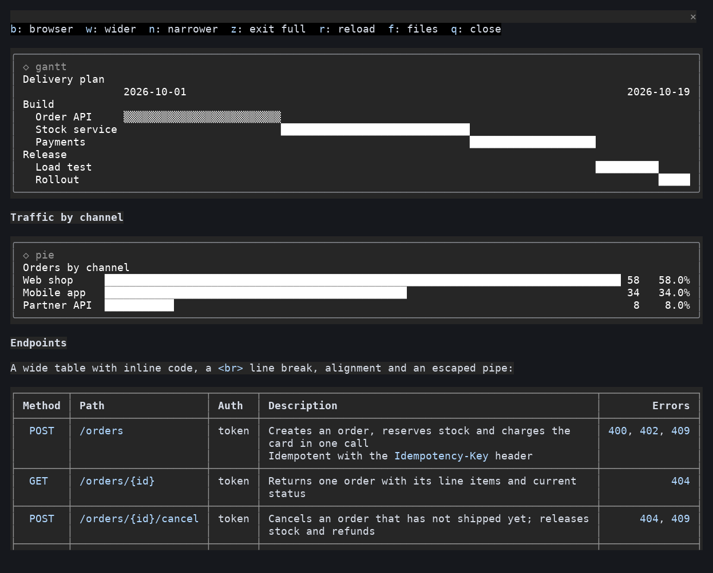
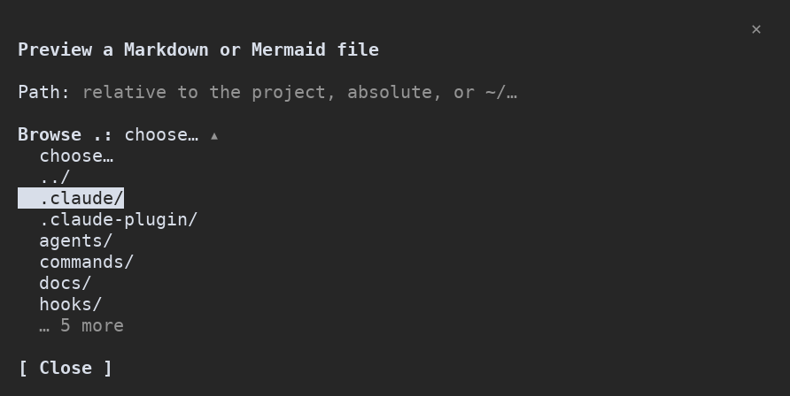
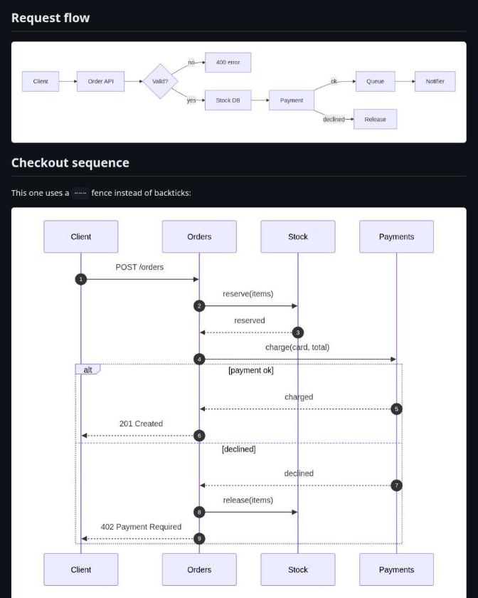

# doc-preview

A Claude Code **mod** (a plugin of function hooks) that previews Markdown and Mermaid files inside the session, and puts the docs and diagrams Claude produces one key away.

> [!NOTE]
> Mods run on Claude Code's function-hooks API, which is early access and may change between releases. This mod was built and tested against Claude Code 2.1.291.

## Screenshots

Taken from real sessions in a 200-column terminal, with `mermaid-ascii` installed.

### Previewing what Claude writes

Ask Claude for a diagram (or have it write a `.md` file) and a line above the prompt offers it:



**Open** shows it in a panel beside the conversation, drawn by `mermaid-ascii`:



### Previewing a file by path





### In the panel

[`examples/sample.md`](examples/sample.md) in full screen (`z`): the toolbar pinned on top, Markdown drawn by Claude Code's renderer, and a flowchart drawn inline by `mermaid-ascii`.



**Scrolled down:** a gantt chart and a pie chart drawn as text by the mod, and a wide table drawn as a grid fitted to the panel. The toolbar stays pinned as you scroll.



**The file picker** (`/xorio:preview` with no path):



**In the browser** (`b`): every diagram drawn by mermaid.js.



## Install

```
/plugin marketplace add radumarias/xorio-claude-plugin
/plugin install doc-preview@xorio
```

## Use

**Preview what Claude generates.** When Claude writes or edits a `.md` / `.markdown` / `.mdx` / `.mmd` / `.mermaid` file (plan-mode plans included), or puts a ```` ```mermaid ```` block in a reply, a band appears above the prompt:

```
Preview: docs/plan.md, 1 diagram  [ Open ] [ Browser ] [ Dismiss ]
```

Click a button, or press `ctrl+x tab` then `p` / `b` / `x`.

**Preview a file by path.**

| Command | What it does |
|---------|--------------|
| `/xorio:preview docs/plan.md` | Opens the file: relative to the project, absolute, `~/…` or `file://…` |
| `/xorio:preview some/folder` | Opens the file picker in that folder |
| `/xorio:preview` | Opens the file picker: type a path, pick from **Recent** (what Claude generated this session), or **Browse** folders (only Markdown and Mermaid files are listed) |

The command is a file in the xorio plugin (`commands/preview.md`) that this mod answers. Without xorio installed, the mod registers it as plain `/preview` instead. Paths with any other extension are refused, so a secrets file such as `.env` is never shown.

**In the panel:** a toolbar stays at the top of the panel as you scroll (on the terminal): `b: browser  w: wider  n: narrower  z: full  r: reload  f: files  q: close`. The keys work while the panel has focus; click it, or press `ctrl+x tab`. You can also close it with the `×` in its corner.

- `w` and `n` widen and narrow the panel by 20 columns, between 40 columns and 30 short of the screen's width. `z` toggles full screen, and pressing it again returns to the width before. Full screen asks for the whole terminal, but Claude Code keeps part of it for the conversation (about 70 columns in a 200-column terminal). A width you drag the divider to yourself takes precedence over all three.
- On the terminal, tables are drawn by the mod, fitted to the panel: cells wrap inside their columns (the widest columns first), `<br>` breaks a line, and code, bold and links keep their styling. Only a table that can't fit even with narrow columns becomes a list (one item per row, `Column: value` under it). Desktop and VS Code draw tables natively.
- A **Doc** dropdown switches between recent docs and diagrams.
- A shown file reloads by itself when Claude edits it, and within about 2 seconds when it changes outside Claude Code.

## How things are drawn

- **Markdown** uses Claude Code's own renderer (headings, lists, code). On the terminal the mod draws tables itself, fitted to the panel (see above).
- **Open in browser** writes a page to `~/.cache/claude-doc-preview/` and opens it with the system opener (`xdg-open`, `open` or `explorer`). The page renders the Markdown and every Mermaid diagram. It loads marked, DOMPurify and mermaid.js from jsDelivr at exact versions with SRI hashes; a strict Content-Security-Policy, DOMPurify and Mermaid's `strict` security level keep the document's own HTML from running script.
- **Mermaid inside the panel** depends on what is installed:

| Where | Needs | Drawn as |
|-------|-------|----------|
| Terminal | [`mermaid-ascii`](https://github.com/AlexanderGrooff/mermaid-ascii) | Text-art diagram: flowcharts, sequence and ER diagrams, plus state and class diagrams, which the mod rewrites as flowcharts first (class members are left out) |
| kitty or Ghostty | `mmdc` ([`@mermaid-js/mermaid-cli`](https://github.com/mermaid-js/mermaid-cli)) | PNG image |
| Desktop app / VS Code | `mmdc` | SVG image |
| Anywhere | — | Pie charts as labelled bars and gantt charts as a day-scale timeline, drawn by the mod itself |
| Anywhere, no tool for the type | — | The diagram's source, with a hint to press `b` |

State diagrams with composite states, forks or concurrency, gantt charts with dates other than `YYYY-MM-DD`, and other types (mindmap, timeline, journey, …) fall back to the source.

The mod checks for these tools when it loads; reload the plugin after installing one. Rendered files are cached in `~/.cache/claude-doc-preview/`.

## Develop

```bash
claude --plugin-dir /path/to/xorio-claude-plugin/mods/doc-preview   # load live; edits hot-reload
claude plugin validate mods/doc-preview                              # manifest + hooks module check
claude plugin test mods/doc-preview                                  # tests/*.test.tsx
tsc -p mods/doc-preview                                              # once the mod has loaded once
```

| Path | Purpose |
|------|---------|
| `hooks/register.tsx` | The hooks: `/xorio:preview`, the band, the pane, Write/Edit and reply tracking, rendering, the browser page |
| `hooks/docs.ts` | Pure helpers (splitting a doc into prose, tables and diagrams, drawing tables and text charts, diagram-to-flowchart conversion, paths, hashing, PNG size, the browser page's HTML); no `$` |
| `types/index.d.ts` | The `$.state` contract the module reads and writes |
| `tests/` | `claude plugin test` suites. They are `.test.tsx` so the repo's bare `node --test` doesn't pick them up |

Claude Code writes `.claude-plugin/types/` (the API declarations and the `tsconfig.json` this folder's one extends) each time it loads the mod from disk. That folder ignores itself in git.
