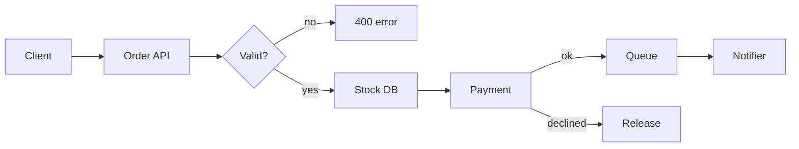
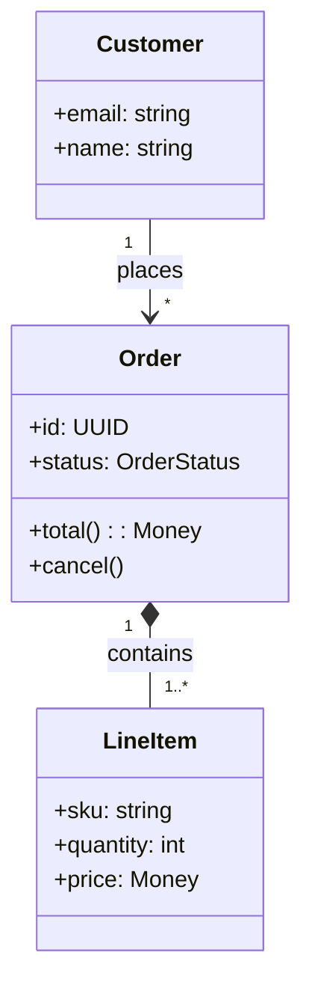
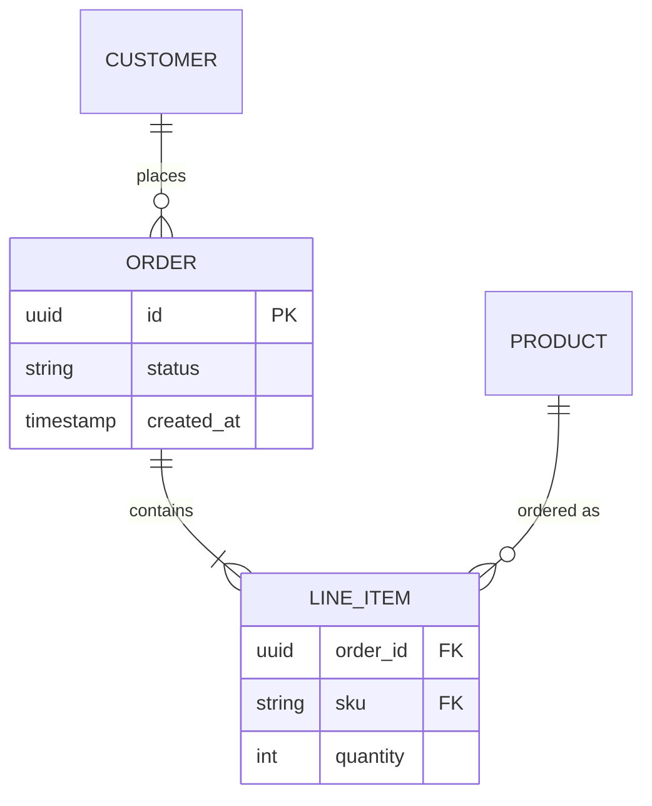
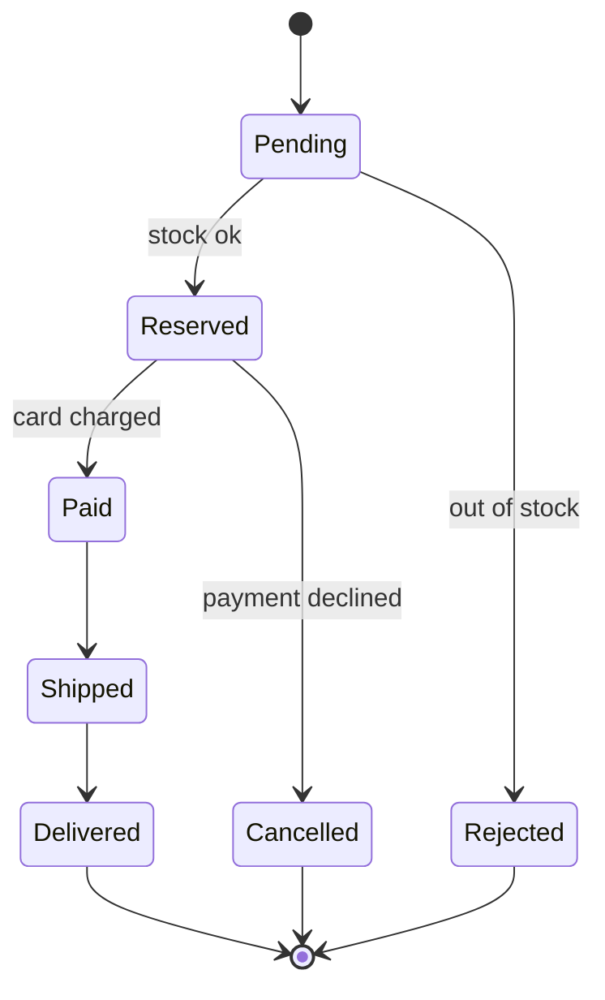
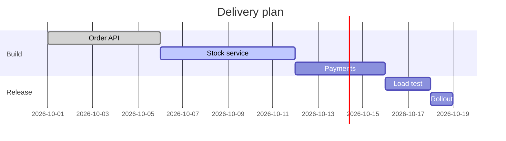
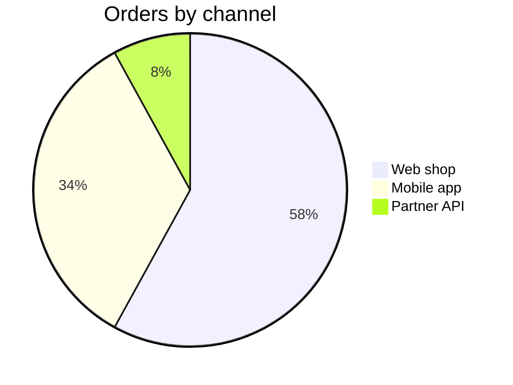
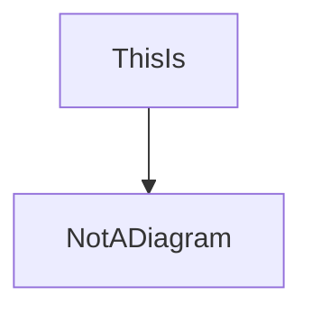

# Order service: design notes

A sample document mixing **Markdown** and *Mermaid* to exercise the `doc-preview` mod. It covers the common Markdown blocks, six diagram types, a wide table and a few edge cases. See the [Mermaid docs](https://mermaid.js.org/) for syntax.

> **Note:** diagrams render inline only when `mermaid-ascii` or `mmdc` is installed. Otherwise press `b` to see them drawn in the browser.

## Goals

1. Accept orders from the web shop and the mobile app
2. Reserve stock before charging the card
3. Notify the customer at every step

- [x] Order intake API
- [x] Stock reservation
- [ ] Refund flow
- [ ] Partial shipments

---

## Request flow



## Checkout sequence

This one uses a `~~~` fence instead of backticks:

~~~mermaid
sequenceDiagram
  autonumber
  participant C as Client
  participant O as Orders
  participant S as Stock
  participant P as Payments
  C->>O: POST /orders
  O->>S: reserve(items)
  S-->>O: reserved
  O->>P: charge(card, total)
  alt payment ok
    P-->>O: charged
    O-->>C: 201 Created
  else declined
    P-->>O: declined
    O->>S: release(items)
    O-->>C: 402 Payment Required
  end
~~~

## Domain model



## Storage



## Order lifecycle



## Plan



## Traffic by channel



## Endpoints

A wide table with inline code, a `<br>` line break, alignment and an escaped pipe:

| Method | Path | Auth | Description | Errors |
|:------:|------|:----:|-------------|-------:|
| `POST` | `/orders` | token | Creates an order, reserves stock and charges the card in one call<br>Idempotent with the `Idempotency-Key` header | `400`, `402`, `409` |
| `GET` | `/orders/{id}` | token | Returns one order with its line items and current status | `404` |
| `POST` | `/orders/{id}/cancel` | token | Cancels an order that has not shipped yet; releases stock and refunds | `404`, `409` |
| `GET` | `/health` | — | Liveness probe: `ok` \| `degraded` | — |

## Code

A regular code block, which should stay code:

```ts
export async function placeOrder(order: Order): Promise<OrderId> {
  await stock.reserve(order.items)
  const charge = await payments.charge(order.card, order.total())
  return orders.save({ ...order, chargeId: charge.id })
}
```

And a Mermaid block quoted inside a Markdown fence, which should also stay code rather than become a diagram:

````md

````

---

*End of sample.* Edit this file while it's open in the pane: it reloads within about two seconds.
